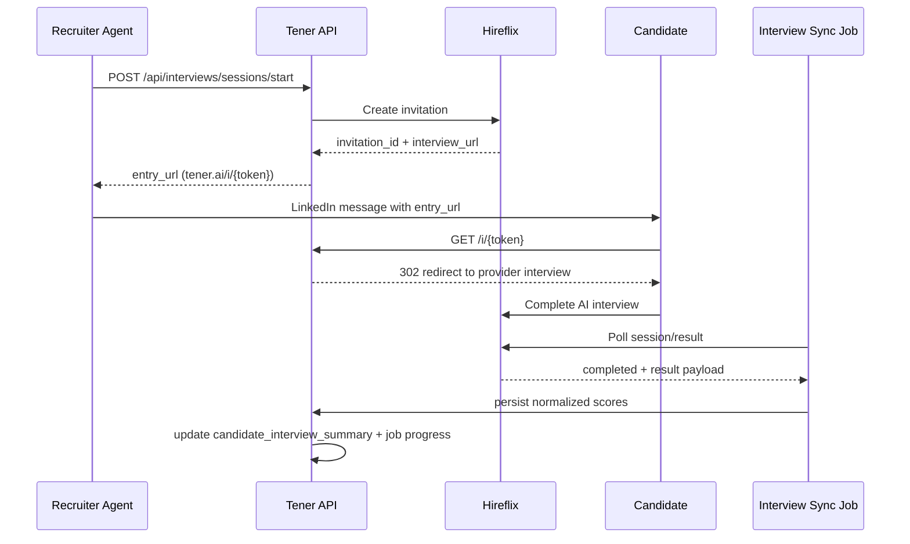

# AI Interview Module: Architecture + Technical Contract (v1)

## 1. Scope

Purpose: separate module for AI interview flow, integrated with existing `jobs/candidates/conversations` pipeline.

Candidate journey:
1. Recruiter sends LinkedIn message with interview link.
2. Candidate opens Tener link.
3. Module starts provider interview session (Hireflix) and redirects candidate.
4. Module receives/syncs completion status and results.
5. Results are normalized into `technical`, `soft_skills`, `culture_fit`, `total`.
6. Scores are attached to candidate profile and used for ranking.

## 2. Non-goals (v1)

- No live human interviewer orchestration.
- No replacing existing `pre_resume` flow.
- No ATS integration beyond current Tener DB/API.

## 3. Module Boundaries

New internal components:
- `InterviewService` (session lifecycle + orchestration)
- `InterviewProviderAdapter` (Hireflix API adapter)
- `InterviewScoringEngine` (normalization + weighted total)
- `InterviewTokenService` (signed candidate link tokens)
- `InterviewSyncJob` (polling for session/result updates)

Integrations with existing backend:
- uses existing `jobs`, `candidates`, `conversations`, `candidate_job_matches`
- writes job step progress (`job_step_progress.step = "interview"`)
- writes operation logs (`operation_logs`)

## 4. Data Model (SQLite)

### 4.1 `interview_sessions`

```sql
CREATE TABLE IF NOT EXISTS interview_sessions (
    id INTEGER PRIMARY KEY AUTOINCREMENT,
    session_id TEXT UNIQUE NOT NULL,               -- public UUID
    job_id INTEGER NOT NULL,
    candidate_id INTEGER NOT NULL,
    conversation_id INTEGER,
    provider TEXT NOT NULL,                        -- "hireflix"
    provider_assessment_id TEXT,
    provider_invitation_id TEXT,
    provider_candidate_id TEXT,
    status TEXT NOT NULL,                          -- created|invited|in_progress|completed|scored|expired|canceled|failed
    language TEXT,
    entry_token_hash TEXT UNIQUE NOT NULL,         -- hash of one-time/expiring token
    entry_token_expires_at TEXT NOT NULL,
    provider_interview_url TEXT,
    started_at TEXT,
    completed_at TEXT,
    scored_at TEXT,
    last_sync_at TEXT,
    last_error_code TEXT,
    last_error_message TEXT,
    created_at TEXT NOT NULL,
    updated_at TEXT NOT NULL,
    FOREIGN KEY(job_id) REFERENCES jobs(id),
    FOREIGN KEY(candidate_id) REFERENCES candidates(id),
    FOREIGN KEY(conversation_id) REFERENCES conversations(id)
);
```

Indexes:
- `idx_interview_sessions_job_status(job_id, status)`
- `idx_interview_sessions_candidate(candidate_id)`
- `idx_interview_sessions_provider(provider, provider_invitation_id)`

### 4.2 `interview_results`

```sql
CREATE TABLE IF NOT EXISTS interview_results (
    id INTEGER PRIMARY KEY AUTOINCREMENT,
    session_id TEXT NOT NULL,
    provider_result_id TEXT,
    result_version INTEGER NOT NULL DEFAULT 1,
    technical_score REAL,
    soft_skills_score REAL,
    culture_fit_score REAL,
    total_score REAL,
    score_confidence REAL,                         -- 0..1
    pass_recommendation TEXT,                      -- strong_yes|yes|mixed|no
    normalized_json TEXT NOT NULL,                 -- rubric-level details
    raw_payload TEXT NOT NULL,                     -- raw provider payload
    created_at TEXT NOT NULL,
    UNIQUE(session_id, result_version),
    FOREIGN KEY(session_id) REFERENCES interview_sessions(session_id)
);
```

### 4.3 `interview_events`

```sql
CREATE TABLE IF NOT EXISTS interview_events (
    id INTEGER PRIMARY KEY AUTOINCREMENT,
    session_id TEXT NOT NULL,
    event_type TEXT NOT NULL,                      -- invited|link_opened|provider_started|provider_completed|scored|sync_failed|...
    source TEXT NOT NULL,                          -- system|candidate|provider|webhook|poller
    payload TEXT,
    created_at TEXT NOT NULL,
    FOREIGN KEY(session_id) REFERENCES interview_sessions(session_id)
);
```

### 4.4 `candidate_interview_summary`

```sql
CREATE TABLE IF NOT EXISTS candidate_interview_summary (
    job_id INTEGER NOT NULL,
    candidate_id INTEGER NOT NULL,
    session_id TEXT NOT NULL,
    interview_status TEXT NOT NULL,                -- not_started|in_progress|completed|scored|failed
    technical_score REAL,
    soft_skills_score REAL,
    culture_fit_score REAL,
    total_score REAL,
    score_confidence REAL,
    updated_at TEXT NOT NULL,
    PRIMARY KEY(job_id, candidate_id),
    FOREIGN KEY(session_id) REFERENCES interview_sessions(session_id)
);
```

## 5. Status Model

Session state machine:
1. `created`
2. `invited`
3. `in_progress`
4. `completed`
5. `scored`
6. terminal: `expired` | `canceled` | `failed`

Transition rules:
- `created -> invited`: provider invitation created
- `invited -> in_progress`: candidate opened link and provider accepted start
- `in_progress -> completed`: provider marks interview complete
- `completed -> scored`: Tener scoring persisted
- any state -> `failed`: unrecoverable provider/API failure
- `invited -> expired`: token expiration reached before completion

## 6. Scoring Contract

Target output scores are `0..100`:
- `technical_score`
- `soft_skills_score`
- `culture_fit_score`
- `total_score`

Default total formula (from product spec):
- `total = technical*0.5 + soft_skills*0.3 + culture_fit*0.2`

If one dimension is missing:
- re-normalize by available weights
- set `score_confidence < 1.0`
- include missing dimensions in `normalized_json.missing_dimensions`

## 7. REST API Contract (v1)

Base prefix: `/api/interviews`

### 7.1 Create interview session (internal)

`POST /api/interviews/sessions/start`

Request:
```json
{
  "job_id": 1,
  "candidate_id": 42,
  "candidate_email": "candidate@example.com",
  "conversation_id": 77,
  "language": "en",
  "provider": "hireflix",
  "ttl_hours": 72
}
```

Response `201`:
```json
{
  "session_id": "iv_4e8a9f27e7f24de88f2b4f2f8a9d0f5c",
  "status": "invited",
  "entry_url": "https://app.tener.ai/i/eyJ...",
  "expires_at": "2026-02-27T10:00:00+00:00",
  "provider": {
    "name": "hireflix",
    "invitation_id": "tgr_inv_123"
  }
}
```

### 7.2 Candidate link resolve (public)

`GET /i/{token}`

Behavior:
- validate token signature + expiry
- load session
- create event `link_opened`
- redirect `302` to provider interview URL

Errors:
- `410` expired token
- `404` unknown/invalid token

### 7.3 Get session

`GET /api/interviews/sessions/{session_id}`

Response `200`:
```json
{
  "session_id": "iv_...",
  "job_id": 1,
  "candidate_id": 42,
  "status": "in_progress",
  "provider": "hireflix",
  "started_at": "2026-02-24T10:10:00+00:00",
  "completed_at": null,
  "last_sync_at": "2026-02-24T10:30:00+00:00",
  "summary": {
    "technical_score": null,
    "soft_skills_score": null,
    "culture_fit_score": null,
    "total_score": null
  }
}
```

### 7.3.1 Get session scorecard (per-question scoring)

`GET /api/interviews/sessions/{session_id}/scorecard`

Response `200`:
```json
{
  "session_id": "iv_...",
  "status": "scored",
  "scorecard": {
    "technical_score": 81.5,
    "soft_skills_score": 78.0,
    "culture_fit_score": 84.0,
    "total_score": 80.95,
    "score_confidence": 1.0,
    "transcription_scoring": {
      "applied": true,
      "question_scores": []
    }
  }
}
```

### 7.4 Manual sync (internal)

`POST /api/interviews/sessions/{session_id}/refresh`

Request:
```json
{
  "force": false
}
```

Response `200`:
```json
{
  "session_id": "iv_...",
  "status": "scored",
  "updated": true,
  "result": {
    "technical_score": 81.5,
    "soft_skills_score": 78.0,
    "culture_fit_score": 84.0,
    "total_score": 80.95,
    "score_confidence": 1.0
  }
}
```

### 7.5 List sessions

`GET /api/interviews/sessions?job_id=1&status=in_progress&limit=100`

Response `200`:
```json
{
  "items": []
}
```

### 7.6 Job leaderboard

`GET /api/jobs/{job_id}/interview-leaderboard?limit=50`

Sorting:
1. candidates with both `technical_score` and `soft_skills_score`
2. candidates with one of them
3. candidates with no interview score
Within each group: `total_score DESC`

Response `200`:
```json
{
  "job_id": 1,
  "items": [
    {
      "candidate_id": 42,
      "candidate_name": "Jane Doe",
      "interview_status": "scored",
      "technical_score": 81.5,
      "soft_skills_score": 78.0,
      "culture_fit_score": 84.0,
      "total_score": 80.95
    }
  ]
}
```

### 7.7 Batch interview step (pipeline)

`POST /api/steps/interview`

Request:
```json
{
  "job_id": 1,
  "candidate_ids": [42, 43, 44],
  "mode": "start_or_refresh"
}
```

Response `200`:
```json
{
  "job_id": 1,
  "started": 2,
  "in_progress": 1,
  "scored": 1,
  "failed": 0,
  "items": []
}
```

Also persist:
- `job_step_progress(job_id, step="interview")`

### 7.8 Admin dashboard endpoints (isolated UI)

Dashboard route:
- `GET /dashboard` (or `GET /`)

Read JD list from source DB:
- `GET /api/admin/jobs?limit=200`

Read candidates mapped to JD:
- `GET /api/admin/jobs/{job_id}/candidates?limit=500`

Bulk refresh all sessions for JD:
- `POST /api/admin/jobs/{job_id}/sessions/refresh`

Request:
```json
{
  "force": true,
  "limit": 300
}
```

Response:
```json
{
  "job_id": 1,
  "total_sessions": 12,
  "refreshed": 10,
  "skipped_terminal": 2,
  "scored": 7,
  "failed": 1,
  "errors": 0,
  "items": []
}
```

## 8. Error Contract

Error shape (all endpoints):
```json
{
  "error": "human readable message",
  "code": "INTERVIEW_PROVIDER_TIMEOUT",
  "details": {}
}
```

Status codes:
- `400` validation error
- `404` entity not found
- `409` state conflict (already scored, duplicate start)
- `410` expired interview link
- `422` provider rejected request
- `500` internal failure
- `502` provider unavailable

## 9. Idempotency and Deduplication

Required for POST endpoints:
- header `Idempotency-Key`

Rules:
- same key + same route + same payload hash => return original response
- same key + different payload => `409`

Provider/webhook dedup:
- store unique event keys in existing `webhook_events`

## 10. Security

- Candidate link token is signed (HMAC-SHA256) and short-lived.
- Token payload: `session_id`, `job_id`, `candidate_id`, `exp`.
- Store only `token_hash` in DB.
- Never expose provider API key in client-side code.

## 11. Observability

`operation_logs` examples:
- `interview.session.created`
- `interview.provider.invite.sent`
- `interview.provider.sync.ok`
- `interview.provider.sync.error`
- `interview.scoring.completed`

Metrics:
- invite success rate
- completion rate
- median time `invited -> completed`
- scoring latency
- provider error rate

## 12. End-to-end Sequence



## 13. Implementation Plan (incremental)

1. DB migration + repository methods for 4 new tables.
2. Provider adapter interface + Hireflix implementation.
3. Token service + `/i/{token}` route.
4. Interview service + `POST/GET /api/interviews/sessions...`.
5. Scoring engine + result normalization contract.
6. `POST /api/steps/interview` + job step progress integration.
7. Leaderboard endpoint for dashboard/admin page.
8. Polling sync job + retry/backoff + idempotency.
9. E2E tests and API contract coverage.

## 14. Provider Runtime Modes

- `TENER_INTERVIEW_PROVIDER=hireflix_mock` (default): deterministic local stub, no external calls.
- `TENER_INTERVIEW_PROVIDER=hireflix`: real Hireflix GraphQL adapter.

Required env for real adapter:
- `TENER_HIREFLIX_API_KEY`
- `TENER_HIREFLIX_POSITION_ID` (optional if module creates per-job positions dynamically)

Optional env:
- `TENER_HIREFLIX_BASE_URL` (default `https://api.hireflix.com/me`)
- `TENER_HIREFLIX_PUBLIC_APP_BASE` (default `https://app.hireflix.com`)
- `TENER_HIREFLIX_TIMEOUT_SECONDS` (default `30`)
- `TENER_INTERVIEW_SOURCE_DB_PATH` (default `./runtime/tener_v1.sqlite3`)
- `TENER_INTERVIEW_SOURCE_API_BASE` (if set, use main Tener API as JD/candidate source)
- `TENER_INTERVIEW_SOURCE_API_TIMEOUT_SECONDS` (default `20`)
- `TENER_INTERVIEW_TRANSCRIPTION_SCORING_CRITERIA_PATH` (default `./config/interview_transcription_scoring_criteria.json`)
- `TENER_INTERVIEW_TOTAL_SCORE_FORMULA_PATH` (default `./config/interview_total_score_formula.json`)
- `TENER_INTERVIEW_QUESTION_GUIDELINES_PATH` (default `./config/interview_question_generation_guidelines.json`)
- `TENER_INTERVIEW_COMPANY_PROFILE_PATH` (default `./config/company_profile.json`)
- `TENER_INTERVIEW_COMPANY_NAME` (default `Tener`)
- `TENER_INTERVIEW_ALLOW_SYNTHETIC_EMAIL` (default `true`)
- `TENER_INTERVIEW_SYNTHETIC_EMAIL_DOMAIN` (default `interview.local`)
