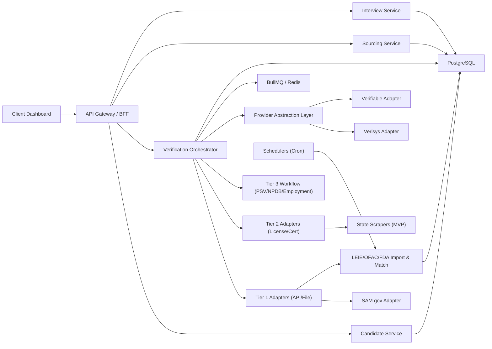

# Tener Life Sciences: Архитектура, версии продукта и проектный план

## 1) Что взято за основу

Источник требований:
- `Tener_AI_Life_Sciences_Product_Specification.docx` (v1.0, февраль 2026)
- `tener-verification-types.md`
- `tener-ls-e2e-test-scenario.md`

Ключевая цель продукта:
- Ускорить hiring в life sciences за счет параллельного рекрутинга и credential verification.
- Сдвинуть проверку credentials в начало воронки (до интервью), а не после финального кандидата.

---

## 2) Целевая архитектура решения

### 2.1 Логическая архитектура

### 2.2 Сервисы

1. `Candidate Service`
- intake кандидата, профиль, статусы pipeline.
- хранит self-reported данные и документы.

2. `Verification Orchestrator`
- единая точка запуска/повторов credential-check.
- строит задания по tier-логике, маршрутизирует по адаптерам.
- нормализует результаты в единый формат `check_result`.

3. `Provider Abstraction Layer` (обязательный слой с первого релиза)
- интерфейс `check(candidate, checkType)` и выбор провайдера:
  - self-hosted (Type 1/2/3/4/6),
  - external aggregators (Type 5: Verisys/Verifiable).
- позволяет подключить enterprise-партнёров без изменений UI/бизнес-потока.

4. `Data Import & Matching Service`
- загрузка и парсинг публичных реестров (LEIE, OFAC, FDA).
- fuzzy/phonetic matching + верификация по DOB.

5. `Workflow & Notification Service`
- очереди BullMQ, SLA по проверкам, ретраи, дедлеттер.
- e-mail workflow для Tier 3 (PSV/employment/certification).

6. `Compliance UI`
- traffic light (GREEN/YELLOW/RED), прогресс `x/15`.
- аудит, история источников и timestamps.

### 2.3 Data model (минимум)

Основные таблицы:
- `candidates`
- `credential_checks` (чек как сущность: тип, статус, SLA, источник)
- `check_results` (сырой ответ + normalized fields + confidence + evidence)
- `verification_tasks` (queue linkage, retries, last_error)
- `leie_exclusions`, `ofac_sdn`, `fda_debarment`, `fda_investigators`
- `documents` (secure storage metadata)
- `audit_events`

### 2.4 Принятые архитектурные принципы

1. Проверки запускаются параллельно, где возможно (Tier 1 всегда параллелен).
2. Любой внешний источник обёрнут адаптером + нормализацией.
3. Нет автоматического reject только по fuzzy match; только flag + human review.
4. Все результаты traceable: источник, метод, версия парсера, timestamp.
5. Продукт разделяет:
- `Automated` (machine-verified),
- `Semi-automated` (system-initiated + manual confirmation),
- `Manual`.

---

## 3) Версии продукта (Product Versioning)

## 3.1 Версия `v0.1` — Prototype Demo (4 недели)

Цель: показать end-to-end value для design partners.

Состав:
- Fully automated:
  - OIG LEIE (file->DB),
  - SAM.gov API,
  - OFAC (file/opensanctions),
  - FDA Debarment (file->DB).
- Semi-automated:
  - intake self-report + document upload,
  - email templates + reminders.
- Optional real adapter:
  - 1 state scraper (CA) для демо.
- Остальные проверки — симулированы, но в реальном workflow/status-model.

Критерий успеха:
- <30 сек на Tier 1 полный прогон.
- В pipeline виден compliance статус до интервью.

## 3.2 Версия `v1.0` — MVP Production (8-12 недель)

Цель: коммерчески применимый продукт без enterprise-партнёрств как blocker.

Состав:
- 5 автоматизированных проверок Tier 1/Tier 2-public data (включая FDA investigators).
- 5-state license scraping (CA/TX/NY/MA/NJ) с мониторингом поломок.
- ingestion + OCR + trust score для документов.
- аудит, отчёт PDF, role-based access.
- SLA/alerts по интеграциям и импорту данных.

Критерий успеха:
- 60%+ проверок закрываются без ручного поиска.
- Снижение доли поздних "compliance fail" на финальном этапе.

## 3.3 Версия `v1.1` — Scale & Reliability (4-6 недель после v1.0)

Состав:
- hardening скраперов, canary checks, авто-детект изменения HTML.
- backfill/reprocessing pipeline.
- compliance center метрики и cohort analytics.
- расширение покрытия штатов и улучшенный entity resolution.

## 3.4 Версия `v2.0` — Enterprise Integrations

Состав:
- Verisys integration (FACIS, DEA, full-state licenses, abuse registries).
- Verifiable integration (NPDB automated workflows).
- continuous monitoring post-hire.

Зависимость:
- завершённые контракты и legal/infosec approval со стороны провайдеров.

---

## 4) Проектный план (дорожная карта реализации)

## Фаза 0: Подготовка (Неделя 1)
1. Зафиксировать source-of-truth по каждому check type.
2. Утвердить data contracts и unified result schema.
3. Подготовить env secrets, rate-limit policy, audit policy.

Deliverables:
- архитектурный ADR по abstraction layer.
- таблица проверок с `method_of_record` (API/File/Scrape/Email/Partner).

## Фаза 1: Data Foundation (Недели 2-3)
1. Импортеры LEIE/OFAC/FDA + расписания обновлений.
2. База данных + индексы (`pg_trgm`) + confidence scoring.
3. SAM.gov client с retry/rate-limit/cache.

Deliverables:
- стабильный Tier 1 backend API.
- интеграционные тесты по импортам и матчеру.

## Фаза 2: Verification Pipeline (Недели 4-5)
1. Orchestrator + BullMQ workflows.
2. Запуск Tier 1 checks в параллель.
3. Нормализация результатов и traffic-light logic.

Deliverables:
- `Run Compliance Check` end-to-end.
- status transitions и audit trail.

## Фаза 3: Semi-Automation Layer (Недели 6-7)
1. Расширенный intake с document upload.
2. OCR extraction + mismatch detection.
3. Email verification workflows + reminder SLA.

Deliverables:
- self-reported -> verification queue -> status tracking.

## Фаза 4: State License MVP (Недели 8-9)
1. 5 приоритетных state adapters.
2. Мониторинг доступности/ломкости скраперов.
3. Failover logic (retry + manual fallback queue).

Deliverables:
- production-ready state license module для top-5 штатов.

## Фаза 5: UI, Reporting, Launch (Недели 10-12)
1. Pipeline compliance column + candidate detail panel.
2. Экспорт отчёта, фильтры, алерты.
3. UAT на сценариях PASS / FLAG / PENDING.

Deliverables:
- MVP релиз `v1.0`.
- launch checklist и операционные runbooks.

---

## 5) KPI и контрольные метрики

Product KPI:
- Tier 1 median latency.
- % кандидатов с проверкой до первого интервью.
- false-positive rate по санкциям/исключениям.
- доля late-stage compliance failures.

Operational KPI:
- import success rate.
- scraper health rate по штатам.
- queue backlog age.
- время до ручного resolution (flagged cases).

---

## 6) Основные риски и mitigation

1. Риск: нестабильные state сайты и CAPTCHA.
- Mitigation: adapter isolation, DOM contract tests, fallback manual queue.

2. Риск: ограничения API (SAM/OpenSanctions).
- Mitigation: caching, batching, account tier upgrade, graceful degradation.

3. Риск: расхождения между источниками и ложные совпадения.
- Mitigation: confidence model + DOB/SSN secondary verification + human review.

4. Риск: партнёрские интеграции затягиваются (Verisys/Verifiable).
- Mitigation: product работает автономно на self-hosted + semi-auto до подписания.

---

## 7) Рекомендованный порядок запуска

1. Запустить `v0.1` для 2-3 design partners в biotech.
2. На их данных откалибровать thresholds и UX flagged flows.
3. Перейти к `v1.0` только после стабильности Tier 1 + top-5 license checks.
4. Интеграции Verisys/Verifiable вести параллельно как `v2.0` трек.
